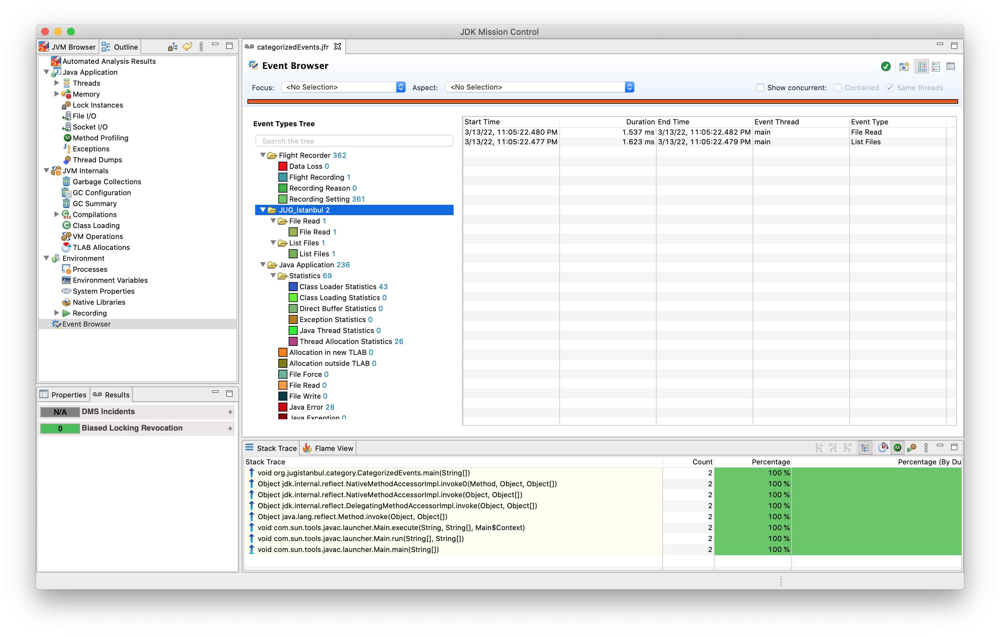

# Categories

Categories allow you to separate events. This module shows you how categories avoid overlap when events are represented in a graphical user interface.

```java
    @Name("com.oracle.FileRead")
    @Label(FILE_READ)
    @Category({FLIGHT_RECORDER_SAMPLES, FILE_READ})
    private static class FileRead extends Event {
        @DataAmount
        int bytesReaden;
    }

    @Name("com.oracle.FileList")
    @Label(LIST_FILES)
    @Category({FLIGHT_RECORDER_SAMPLES, LIST_FILES})
    private static class FileList extends Event {}

    public static void main(String[] args) {

        FileList fileList = new FileList();
        fileList.begin();
        Path resourceDirectory = Paths.get("file");
        var dir = resourceDirectory.toAbsolutePath().toString();
        Set<String> files = listFiles(dir);
        fileList.commit();

        FileRead fileRead = new FileRead();
        fileRead.begin();
        files.forEach(file -> {
            try {
                fileRead.bytesReaden += Files.readString(Path.of(String.join("/", dir, file))).getBytes().length;
            } catch (IOException e) {
                e.printStackTrace();
            }
        });

        fileRead.commit();
    }
```

## To start recording
```bash
# sh recordEvent.sh

java -XX:StartFlightRecording:filename=categorizedEvents.jfr CategorizedEvents.java

[0.692s][info][jfr,startup] Started recording 1. No limit specified, using maxsize=250MB as default.
[0.692s][info][jfr,startup] 
[0.692s][info][jfr,startup] Use jcmd 13209 JFR.dump name=1 to copy recording data to file.
```

## To view and parse the recordings
```bash
# jfr print --events FileList categorizedEvents.jfr
# jfr print --events FileRead categorizedEvents.jfr

# make sure the categorizedEvents.jfr file is created before running this script
jfr print --categories JUG_Istanbul categorizedEvents.jfr

com.oracle.FileList {
  startTime = 23:05:22.476
  duration = 1.62 ms
  eventThread = "main" (javaThreadId = 1)
  stackTrace = [
    org.jugistanbul.category.CategorizedEvents.main(String[]) line: 45
    jdk.internal.reflect.NativeMethodAccessorImpl.invoke0(Method, Object, Object[])
    jdk.internal.reflect.NativeMethodAccessorImpl.invoke(Object, Object[]) line: 77
    jdk.internal.reflect.DelegatingMethodAccessorImpl.invoke(Object, Object[]) line: 43
    java.lang.reflect.Method.invoke(Object, Object[]) line: 568
    ...
  ]
}

com.oracle.FileRead {
  startTime = 23:05:22.480
  duration = 1.54 ms
  bytesReader = 12 bytes
  eventThread = "main" (javaThreadId = 1)
  stackTrace = [
    org.jugistanbul.category.CategorizedEvents.main(String[]) line: 57
    jdk.internal.reflect.NativeMethodAccessorImpl.invoke0(Method, Object, Object[])
    jdk.internal.reflect.NativeMethodAccessorImpl.invoke(Object, Object[]) line: 77
    jdk.internal.reflect.DelegatingMethodAccessorImpl.invoke(Object, Object[]) line: 43
    java.lang.reflect.Method.invoke(Object, Object[]) line: 568
    ...
  ]
}
```


