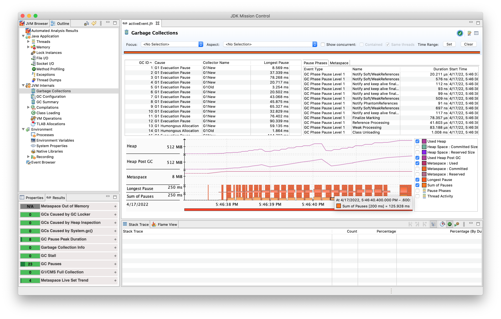

# Event Stream

FlightRecorder API allows you to subscribe to specific JFR data via event streaming. An event stream is a sequence of events. Streams that start with a recording are called active event streams, while streams created from the current JVM repository are called passive event streams. This module exemplifies the use of event streams to monitoring events.

```java
        try (var rs = new RecordingStream()) {
            rs.onEvent("jdk.GarbageCollection", event -> {
                System.out.println("Garbage collection: " + event.getLong("gcId"));
                System.out.println("Cause: " + event.getString("cause"));
                System.out.println("Total pause: " + event.getDuration("sumOfPauses"));
                System.out.println("Longest pause: " + event.getDuration("longestPause"));
                System.out.println();
            });
            rs.startAsync();

            for (int i = 0; i < 1_000_000; i++) {
                List<Integer> numberList = new ArrayList<>();
                for (int j = 0; j < 1_000_000; j++) {
                    numberList.add(j);
                }
            }
        }
```

```java
        AtomicInteger timer = new AtomicInteger();

        try (var es = EventStream.openRepository()) {
            es.onEvent("jdk.CPULoad", event -> {
            System.out.println("CPU Load " + event.getEndTime());
            System.out.println("Machine total: " + 100 * event.getFloat("machineTotal") + "%");
            System.out.println("JVM User: " + 100 * event.getFloat("jvmUser") + "%");
            System.out.println("JVM System: " + 100 * event.getFloat("jvmSystem") + "%");
            System.out.println();
    
            if (timer.incrementAndGet() == CPU_LOAD_EVENTS) {
                System.exit(0);
            }
        });

        es.start();
        }
```

```java
        var client = HttpClient.newBuilder().connectTimeout(Duration.ofSeconds(5)).build();
        var request = HttpRequest.newBuilder(URI.create(URL)).GET().build();

        try (var rs = new RecordingStream()){

            rs.onEvent("jdk.VirtualThreadPinned", event -> {
                System.out.println("Cause: " + event.getString("cause"));
                System.out.println("Total pause: " + event.getDuration("sumOfPauses"));
                System.out.println("Longest pause: " + event.getDuration("longestPause"));
                System.out.println();
            });

            rs.startAsync();

            var virtualThread = Thread.startVirtualThread(() -> getBodyAsString(client, request));
            virtualThread.join();
        }
```
## To start recording

```bash
# sh recordActiveEvent.sh

java -XX:StartFlightRecording:filename=activeEvent.jfr GarbageCollectionInfoEvent.java

[0.615s][info][jfr,startup] Started recording 1. No limit specified, using maxsize=250MB as default.
[0.615s][info][jfr,startup] 
[0.615s][info][jfr,startup] Use jcmd 17470 JFR.dump name=1 to copy recording data to file.
Garbage collection: 2
Cause: G1 Evacuation Pause
Total pause: PT0.037338952S
Longest pause: PT0.037338952S

Garbage collection: 3
Cause: G1 Evacuation Pause
Total pause: PT0.078268124S
Longest pause: PT0.078268124S

Garbage collection: 4
Cause: G1 Evacuation Pause
Total pause: PT0.020717297S
Longest pause: PT0.020717297S

Garbage collection: 6
Cause: G1 Evacuation Pause
Total pause: PT0.020502123S
Longest pause: PT0.020502123S
```

```bash
# sh recordPassiveEvent.sh

java -XX:StartFlightRecording:filename=passiveEvent.jfr CPULoadInfoEvent.java

[0.750s][info][jfr,startup] Started recording 1. No limit specified, using maxsize=250MB as default.
[0.750s][info][jfr,startup]
[0.750s][info][jfr,startup] Use jcmd 3838 JFR.dump name=1 to copy recording data to file.
CPU Load 2022-04-19T19:22:59.970643459Z
Machine total: 10.421837%
JVM User: 7.235302%
JVM System: 0.36363786%

CPU Load 2022-04-19T19:23:00.975131505Z
Machine total: 6.203474%
JVM User: 1.4093271%
JVM System: 0.19294728%

CPU Load 2022-04-19T19:23:01.979060839Z
Machine total: 3.9800994%
JVM User: 0.27946898%
JVM System: 0.09509539%

CPU Load 2022-04-19T19:23:02.985512560Z
Machine total: 8.684864%
JVM User: 0.9347291%
JVM System: 0.10542497%

CPU Load 2022-04-19T19:23:03.989737965Z
Machine total: 5.4455442%
JVM User: 0.33999017%
JVM System: 0.13936256%
```

```bash
# sh recordVirtualThreadPinnedEvent.sh

java -XX:StartFlightRecording:filename=virtualThreadPinnedEvent.jfr \
  --enable-preview --source 20 VirtualThreadPinnedEvent.java
  
[0.199s][info][jfr,startup] Started recording 1. No limit specified, using maxsize=250MB as default.
[0.199s][info][jfr,startup] 
[0.199s][info][jfr,startup] Use jcmd 22312 JFR.dump name=1 to copy recording data to file.
Note: VirtualThreadPinnedEvent.java uses preview features of Java SE 19.
Note: Recompile with -Xlint:preview for details.
Body: <!doctype html> ...
```

## To view and parse the recordings

```bash
# sh viewActiveEventRecordFile.sh

# make sure the activeEvent.jfr file is created before running this script
jfr print --events jdk.GarbageCollection activeEvent.jfr

jdk.GarbageCollection {
  startTime = 17:46:37.562 (2022-04-17)
  duration = 8.57 ms
  gcId = 1
  name = "G1New"
  cause = "G1 Evacuation Pause"
  sumOfPauses = 8.57 ms
  longestPause = 8.57 ms
}

jdk.GarbageCollection {
  startTime = 17:46:37.875 (2022-04-17)
  duration = 37.3 ms
  gcId = 2
  name = "G1New"
  cause = "G1 Evacuation Pause"
  sumOfPauses = 37.3 ms
  longestPause = 37.3 ms
}

jdk.GarbageCollection {
  startTime = 17:46:37.993 (2022-04-17)
  duration = 78.3 ms
  gcId = 3
  name = "G1New"
  cause = "G1 Evacuation Pause"
  sumOfPauses = 78.3 ms
  longestPause = 78.3 ms
}
```

```bash
# sh viewPassiveEventRecordFile.sh

# make sure the passiveEvent.jfr file is created before running this script
jfr print --events jdk.CPULoad passiveEvent.jfr

jdk.CPULoad {
startTime = 22:22:59.970 (2022-04-19)
jvmUser = 7.24%
jvmSystem = 0.36%
machineTotal = 10.42%
}

jdk.CPULoad {
startTime = 22:23:00.975 (2022-04-19)
jvmUser = 1.41%
jvmSystem = 0.19%
machineTotal = 6.20%
}

jdk.CPULoad {
startTime = 22:23:01.979 (2022-04-19)
jvmUser = 0.28%
jvmSystem = 0.10%
machineTotal = 3.98%
}

jdk.CPULoad {
startTime = 22:23:02.985 (2022-04-19)
jvmUser = 0.93%
jvmSystem = 0.11%
machineTotal = 8.68%
}

jdk.CPULoad {
startTime = 22:23:03.989 (2022-04-19)
jvmUser = 0.34%
jvmSystem = 0.14%
machineTotal = 5.45%
}
```
```bash
# sh viewVirtualThreadPinnedEventRecordFile.sh

# make sure the virtualThreadPinnedEvent.jfr file is created before running this script
jfr print --events jdk.VirtualThreadPinned virtualThreadPinnedEvent.jfr

jdk.VirtualThreadPinned {
  startTime = 19:12:47.876 (2022-12-05)
  duration = 802 ms
  eventThread = "" (javaThreadId = 35, virtual)
  stackTrace = [
    java.lang.VirtualThread.parkOnCarrierThread(boolean, long) line: 578
    java.lang.VirtualThread.park() line: 501
    java.lang.System$2.parkVirtualThread() line: 2596
    jdk.internal.misc.VirtualThreads.park() line: 54
    java.util.concurrent.locks.LockSupport.park(Object) line: 219
    ...
  ]
}
```


